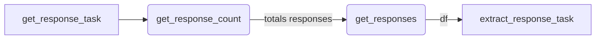
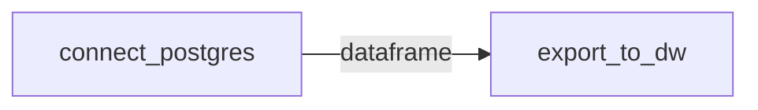
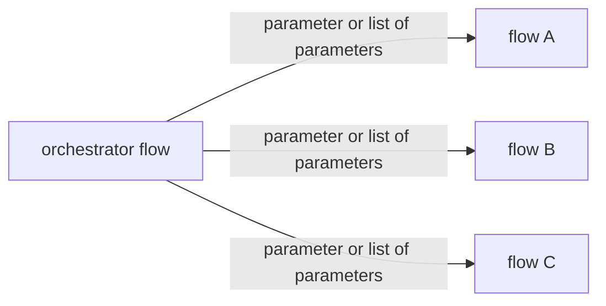

# Prefect Flows uses cases
**Some of the public prefect flows that i have been development.**

Prefect version 0.156 (I hope update this repo for the version >2.0 soom)
Python version 3.6

*There are some other extra libraries that might work with the lastest versions.*

## Send Mail
This is a simple flow that receive basic parameter for work as a mailer. I call it a single mailer for notifications purpose for example. If you want to use it as a survey mailer i suggest use it as a simple python function, not a flow for best perfomance.

**Parameters**
*Example*
```json
{
    "host": "smtp.goole.com",
    "port": 465,
    "email_from": "myemail@domain.com",
    "attach_path_files_list": "['filename1.csv', 'filename2.csv', 'filenamen.csv']",
    "email_from_pass": "secret",
    "recipients": "mailto@domain.com",
    "recipients_cc": "cc@domain.com",
    "subject": "This is a example subject",
    "body_text_plain": "A body text plain for some text only procesor mail client",
    "body_html": "<h1>We can add some html body here<h1/>",
    "pathbase": "Path of the project folder"
}
```

**Flow**

						
## Api Http Request
An example of http request that pull 100 items responses per request, for that we first call the total items responses count for a simple math operation.
Notice that this api use an pre existing static apiKey to authenticate, for that reason we dont create an auth task to login first and request a expirable token.
Addicional we add a transform function that will process your transform code row by row thanks of the `apply()` function.

**Parameter**
This example dont declarate input parameters

**Flow**



## Oracle connections
Simple oracle connections to select, insert or all kind of querys. Based in this repo https://oracle.github.io/python-oracledb/
Also you need to download the oracle instantclient version for windows, linux or macOs. https://cx-oracle.readthedocs.io/en/latest/user_guide/installation.html#installing-cx-oracle-on-windows

In this example we insert some values to a oracle database. This method receive a list of tuples in order to insert the data.
**Parameters**
This flow doesnt receive parameters


## Prefect DB
Prefect use a postgres database, in some cases you will need to make a little ETL for this data, you can use this flow to send some or all the tables of the prefect database to your favorite datawarehouse.
First you need to connect to the postgres database, get the data and return a dataframe, this df will be usefull to insert to the datawarehouse.

**Parameters**
This flow doesnt receive parameters, but you can set a list of the tables to load.

**Flow**


## Orchestrator flow
This flow will orchestrate one o more flows to manage up streams, parameters and others. It's important to know if you want to pass a list of parameters, you need to pass a list of dict to the flow.

**Parameters**
This flow doesnt receive parameters.

**Flow**


## Slack Notifications
Despite the new versions of Prefect have native ways to communicate with slack or teams, this is a way that i find to send this type of notifications.


**Paramaters**
```json
{
    "flow_name": "Flow name",
    "channel": "SLACK_CHANNEL",
    "message": "Notification message",
}
```

**Flow**


## Slack Notifications as State Handler
Prefect have a excelent way to manage state handler, in this exaple we will send a slack notification when any task change it state to `FAIL`

**Parameters**
This flow doesnt receive parameters.

**Flow**

