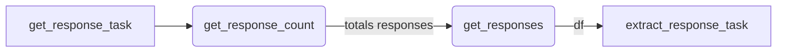

# Prefect Flows uses cases
**Some of the public prefect flows that i have been development.**

Prefect version 0.156 (I hope update this repo for the version >2.0 soom)
Python version 3.6

*There are some other extra libraries that might work with the lastest versions.*

## Send Mail
This is a simple flow that receive basic parameter for work as a mailer. I call it a single mailer for notifications purpose for example. If you want to use it as a survey mailer i suggest use it as a simple python function, not a flow for best perfomance.

**Parameters**
*Example*
```json
{
    "host": "smtp.goole.com",
    "port": 465,
    "email_from": "myemail@domain.com",
    "attach_path_files_list": "['filename1.csv', 'filename2.csv', 'filenamen.csv']",
    "email_from_pass": "secret",
    "recipients": "mailto@domain.com",
    "recipients_cc": "cc@domain.com",
    "subject": "This is a example subject",
    "body_text_plain": "A body text plain for some text only procesor mail client",
    "body_html": "<h1>We can add some html body here<h1/>",
    "pathbase": "Path of the project folder"
}
```

**Flow**

						
## Api Http Request
An example of http request that pull 100 items responses per request, for that we first call the total items responses count for a simple math operation.
Notice that this api use an pre existing static apiKey to authenticate, for that reason we dont create an auth task to login first and request a expirable token.
Addicional we add a transform function that will process your transform code row by row thanks of the `apply()` function.

**Parameter**
This example dont declarate input parameters

**Flow**

